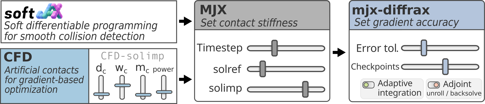

<h2 align='center'>diffmjx: MuJoCo XLA with informative contact gradients</h2>


[](https://arxiv.org/abs/2506.14186)
[](https://sites.google.com/view/diffmjx)

MuJoCo's MJX backend enables GPU-accelerated, differentiable physics simulation in JAX. The gradients produced by MJX can be erroneous, as: 

- **collision detection** may use non-differentiable operations, 

- **contact solver** yield non-zero gradients only for colliding objects, 

- **numerical integrators** with fixed stepsizes cause gradient oscillations due to discretization errors.

**diffmjx** integrates several libraries to address the above issues, enabling gradient-based optimization through rigid-body contact simulations.

> [!NOTE]  
> The compilation of MJX gradient functions is notoriously slow and becomes **even slower when adding adaptive integration**. We are investigating how to speed up compilation, but at the current point be warned that developing algorithms which rely on MJX's autodiff gradient computation could take more time than anticipated.


## Libraries

<p align="center">
  
</p>

### mujoco-mjx (fork)

[](https://github.com/martius-lab/mujoco)

A fork of [MuJoCo XLA](https://github.com/google-deepmind/mujoco) implementing the following features:

- **Contact Force from a Distance (CFD)**: Contact constraints apply miniscule forces even when no
  contact is active, guiding the optimizer toward contact configurations. Straight-through estimation allows to use CFD forces only for gradient computation keeping the forward simulation untouched.

- **`col_soft_enable`** — smoothly differentiable collision detection via [Softjax](#softjax), smoothing the collision detection pipeline.

- **`scan_loop`** — replaces `jax.lax.while_loop` in the constraint solver with a scan-based loop.

### mjx_diffrax
[](https://github.com/martius-lab/mjx_diffrax)

Replaces MJX's built-in Euler and RK4 integrators with adaptive ODE solvers (Tsit5,
Dopri5, and others) from [Diffrax](https://github.com/patrick-kidger/diffrax). Adaptive
stepsize control improves gradient quality by reducing integration errors. Provides `step()` and `multistep()` functions that also allow to run MJX's native integrators. 

### softjax
[](https://github.com/a-paulus/softjax)
[](https://arxiv.org/abs/2603.08824) 

Smooth, differentiable drop-in replacements for non-differentiable JAX operations
(`abs`, `min`, `max`, `sort`, `where`, and others). This repo is used to soften the discrete / discontinuous operators in MJX's collision detection. 
Some collision functions such as `plane-{sphere, ellipsoid, capsule}` and `sphere-sphere` are already smooth in MJX, whereas SoftJax is used to soften the `plane-{cylinder, cube}` and `cube-cube` collisions. More involved collision detection functions such as `mesh-mesh` collisions are currently not supported.


## Installation

### Prerequisites

- Python 3.12+
- CUDA 12 (for GPU acceleration)
- SSH access to the private component repositories

### Setup

```bash
bash setup.sh
uv sync
```

`setup.sh` clones the required repositories into `external/` and creates a
virtual environment. `uv sync` installs all dependencies with the local packages in
editable mode.

## Experiments
Run an experiment with:

```bash
uv run experiments/<experiment>/run.py
```

| `<experiment>` | Description |
|---|---|
| `01_toyexample` | 1-D points mass toy example showing effect of stepsize on simulator gradients |
| `02_tossobjects` | Show effect of adaptive integration on gradient computation |
| `03_billiard` | Billiard balls collide, show effect of CFD on gradient computation |
| `04_time-toss` | Compare compilation times and gradient computation times for a cube toss simulation |


## License

Apache 2.0 — see [LICENSE](LICENSE).

## Citation
If this library helped your academic work, please consider citing:

```bibtex
@inproceedings{
paulus2026differentiable,
title={Differentiable Simulation of Hard Contacts with Soft Gradients for Learning and Control},
author={Anselm Paulus and Andreas Ren{\'e} Geist and Pierre Schumacher and V{\'\i}t Musil and Simon Rappenecker and Georg Martius},
booktitle={The Fourteenth International Conference on Learning Representations},
year={2026},
}
```

(Also consider starring the project [on GitHub](https://github.com/a-paulus/softjax))
